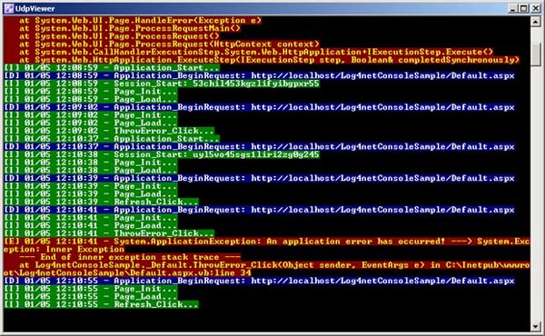

# A log4net Realtime Color Console for ASP.NET #

An article on how to create a real-time log4net color console viewer for ASP.NET applications.

## Pre-Introduction ##

This code borrows quite heavily from a previous example [here on CodeProject](https://www.codeproject.com/Articles/17345/A-log4net-Realtime-Color-Console-for-ASP-NET), but I converted it to C# from Visual Basic.  The previous example was written by Philip Liebscher in 2007 (wow!).

## Introduction ##

This example includes two components:

- A web application that sends log4net log messages out via UDP.  It makes use of the [UdpAppender](http://logging.apache.org/log4net/release/config-examples.html#udpappender) of log4net, which in turn opens a UDP connection upon which to send messages.
- A console application that receives the messages from the web application via its own listening UDP connection.  As it receives them, it renders them out in pretty pretty colors for all to see, like the illustration above.  

## Using the Code ##
The code for the console app is pretty simple:

	using System;
	using System.Net;
	using System.Net.Sockets;
	using System.Reflection;
	using System.Text;
	using log4net;

	internal static class UdpLogListener
	{
		private static readonly ILog Log = LogManager.GetLogger(MethodBase.GetCurrentMethod().DeclaringType);

		public static void Main()
		{
			var Port = 8081; // <-- remember to use the same port in your web/source app.

			try
			{
				 var sender = new IPEndPoint(IPAddress.Any, 0);
				var client = new UdpClient(Port);

				while (true)
				{
					var buffer = client.Receive(ref sender);
					var logLine = Encoding.Default.GetString(buffer);
					// The color	coded text is written to the console when Log.{level method} is called.
					// i.e. Log.Info("my info")
					// Optional: Replace your placeholders with whatever you like. [I]=Info, [D]=Debug, etc.
					// More detail about placeholders in the UdpAppender config below.
					if (logLine.IndexOf("{INFO}") >= 0)
						Log.Info(logLine.Replace("{INFO}", "[I] "));
					else if (logLine.IndexOf("{DEBUG}") >= 0)
						Log.Debug(logLine.Replace("{DEBUG}", "[D] "));
					else if (logLine.IndexOf("{ERROR}") >= 0)
						Log.Error(logLine.Replace("{ERROR}", "[E] "));
					else if (logLine.IndexOf("{WARN}") >= 0)
						Log.Warn(logLine.Replace("{WARN}", "[W] "));
					else
						// Some other level.
						Log.Warn(logLine);
				}
			}
			catch (Exception e)
			{
				Console.WriteLine(e);
				Console.WriteLine("\r\nPress any key to close...");
				Console.ReadLine();
			}
		}
	}

Additionally, there's one more line to add to *AssemblyInfo.cs* in the Properties folder, which will actually configure and switch on log4Net.

    [assembly: XmlConfigurator(Watch = true)]

Configure the `ColoredConsoleAppender` and set the log-level colors. The following goes in your *App.config*:

	<configSections>
		<section name="log4net" type="System.Configuration.IgnoreSectionHandler" />
	</configSections>
	<log4net>
		<appender name="ColoredConsoleAppender" type="log4net.Appender.ColoredConsoleAppender">
			<mapping>
				<level value="INFO" />
				<foreColor value="White, HighIntensity" />
				<backColor value="Green" />
			</mapping>
			<mapping>
				<level value="DEBUG" />
				<foreColor value="White, HighIntensity" />
				<backColor value="Blue" />
			</mapping>
			<mapping>
				<level value="WARN" />
				<foreColor value="Yellow, HighIntensity" />
				<backColor value="Purple" />
			</mapping>
			<mapping>
				<level value="ERROR" />
				<foreColor value="Yellow, HighIntensity" />
				<backColor value="Red" />
			</mapping>
			<layout type="log4net.Layout.PatternLayout">
				<conversionPattern value="%message%newline" />
			</layout>
		</appender>
		<root>
			<level value="ALL" />
			<appender-ref ref="ColoredConsoleAppender" />
		</root>
	</log4net>

The web application gets configured to use an external config file for log4net.  Within that file, you configure a UdpAppender [per the log4net documentation](https://logging.apache.org/log4net/release/config-examples.html):

-   The RemotePort property has to match the port in the console application, which is hard-coded to 8081.
-   The RemoteAddress property is a little more tricky.  log4net came out before mass IPV6 introduction to Windows versions and I guess it's never been updated correctly.  If the console application is on your local machine, you **must** use IP address 127.0.0.1 and **NOT** *localhost*, because log4net will resolve *localhost* to ::1, which is an IPV6 address!!!  If the console application isn't on your local machine, the most direct method to make this work is to use an IPV4 address in the form xxx.xxx.xxx.xxx as opposed to a fully qualified domain name (like myhost.somecompany.com) because the latter might resolve to an IPV6 address instead of an IPV4 address.  Tedious, eh?  Taking note of this will save you many headaches.
-   To help format the output, you can put whichever PatternLayout syntax you like.  Consult the log4net docs for help with that.

	<log4net>
		<appender name="UdpAppender" type="log4net.Appender.UdpAppender">
			<param name="RemoteAddress" value="127.0.0.1" />
			<param name="RemotePort" value="8081" />
			<layout type="log4net.Layout.PatternLayout" value="{%level}%date{MM/dd HH:mm:ss} - %message" />
		</appender>
		<root>
			<level value="ALL" />
			<appender-ref ref="UdpAppender" />
		</root>
	</log4net>

## Points of Interest ##

- The Visual Studio 2017 solution uses .NET 4.60 and it's set up to start the console application, and then the web application, (simultaneously) when you run it.
- You'll have to allow Windows Defender or whatever firewall you're using to actually pass UDP traffic across the port.

